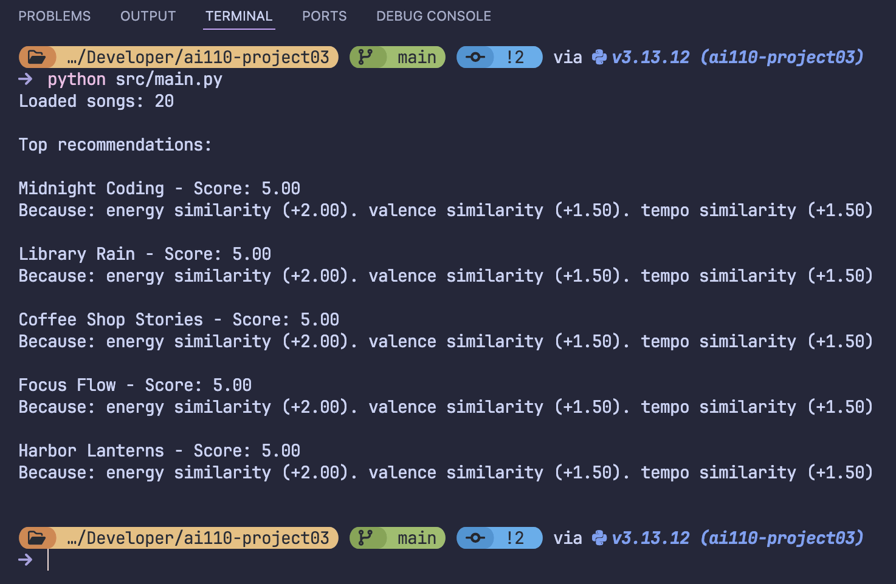
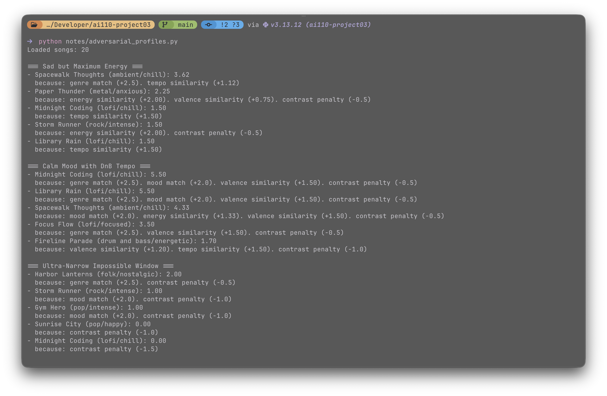
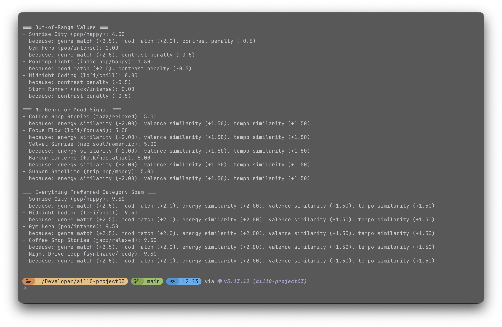
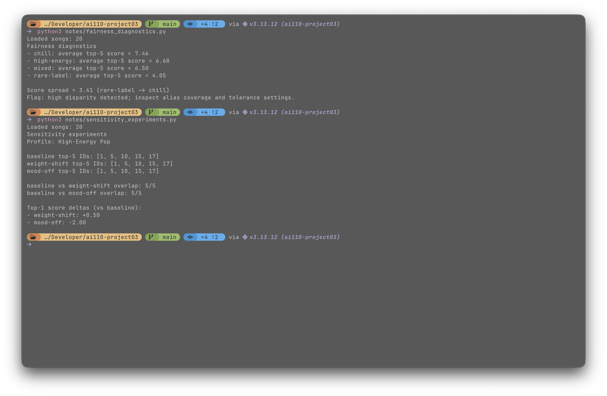
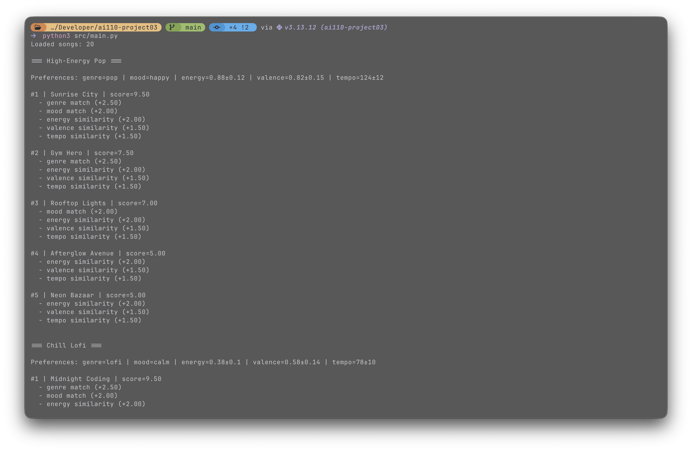

# Music Recommender Simulation

## Project Summary

This project builds a small rule-based music recommender. I give it a user profile, it scores each song in the CSV, and returns the top matches. My version also handles messy inputs better, penalizes contradictory profiles, and adds a light diversity step so the top list is less repetitive. The system is simple on purpose, so I can inspect why each song was ranked where it was.

---

## How The System Works

Real-world recommenders (like Spotify or YouTube) use complex systems with user behavior, collaborative filtering, and content signals to rank results. This project keeps things simple by using a content-based approach that is easy to understand, adjust, and works well with small datasets without needing lots of user data.

- What features does each `Song` use in your system:
    - Each song includes identity fields plus the core matching features `genre`, `mood`, `energy`, `valence`, and `tempo_bpm`, so the system can compare style, vibe, and pace in a clear way.
- What information does your `UserProfile` store:
    - The profile stores lists of preferred `genre` and `mood`, plus target and tolerance values for `energy`, `valence`, and `tempo_bpm`; these values are entered directly instead of learned from behavior history.
- How does your `Recommender` compute a score for each song:
    - The recommender uses a 10-point rule: genre match adds `+2.5`, mood match adds `+2.0`, energy/valence/tempo add similarity points based on distance from targets, and a contrast penalty lowers scores for strong chill-vs-intense mismatch before clamping to `0-10`.
- How do you choose which songs to recommend:
  - After every song is scored, the system stores the result, sorts all songs by final score from highest to lowest, and returns the top-K recommendations.

### Song Object (Core Attributes)

- `genre`: broad style bucket; high-impact first-pass relevance and easy interpretability.
- `mood`: intent-focused label (for example, chill/intense); helps align recommendations to session vibe.
- `energy`: strong signal of perceived intensity; separates calm vs high-drive tracks.
- `valence`: emotional positivity/negativity; complements energy for richer vibe matching.
- `tempo_bpm`: objective pace feature; useful for activity/session pace alignment.

### UserProfile Object (Core Attributes)

- `genre`: list of preferred genres used for exact categorical matching.
- `mood`: list of preferred moods used for exact categorical matching.
- `energy` (`target`, `tolerance`): desired intensity level and acceptable range.
- `valence` (`target`, `tolerance`): desired emotional tone and acceptable range.
- `tempo_bpm` (`target`, `tolerance`): desired pace and acceptable range.

This design follows a simple flow: take user preferences, load songs, score each song with the same rules, then rank results. It has less personalization than production systems, but it is easy to understand, tune, and test.

---

## Experiments You Tried

- I tested five normal presets (pop, lofi, rock, dance, and calm acoustic) to check if top results felt reasonable.
- I ran adversarial profiles, like calm mood with very high tempo, empty category preferences, and very broad category lists.
- I compared baseline scoring against two variants: stronger energy/weaker genre, and mood scoring turned off.
- I also ran a fairness script that compared average top-5 scores across profile groups.
- Main finding: rank order was often stable, but score confidence changed a lot under different settings.

---

## Limitations and Risks

This recommender still has clear limits. The catalog is tiny, so it cannot represent many taste styles.  
It relies on labels and a few numeric features, so it does not understand lyrics, context, or cultural meaning.  
Rare genre/mood wording can still underperform even with alias handling.  
Because scores are deterministic, users can learn how to game profile settings to push certain songs up.

---

## Reflection

Read and complete `model_card.md`:

[**Model Card**](model_card.md)

I learned that even a basic recommender can feel useful when the scoring rules are clear. Breaking the score into simple parts made debugging much easier. It also helped me see why the same songs can keep winning when the data is small and the rules are fixed.

I also learned how bias can appear without any advanced machine learning. If a user’s labels are less represented, their results can look weaker even when the code is “working.” That made fairness checks feel necessary, not optional, even for a classroom project.

---

## Getting Started

### Setup

1. Create a virtual environment (optional but recommended):

```bash
python -m venv .venv
source .venv/bin/activate  # Windows: .venv\Scripts\activate
```

2. Install dependencies

```bash
pip install -r requirements.txt
```

3. Run the app:

```bash
python -m src.main
```

### Running Tests

Run the starter tests with:

```bash
python -m pytest tests/ -v
```

You can add more tests in `tests/test_recommender.py`.

---

## Images

<a href="images/cli-verification.png" target="_blank"></a>

<a href="images/adversarial-profile01.png" target="_blank"></a>

<a href="images/adversarial-profile02.png" target="_blank"></a>

<a href="images/fairness-sensitivity-diagnostic.png" target="_blank"></a>

<a href="images/final.png" target="_blank"></a>